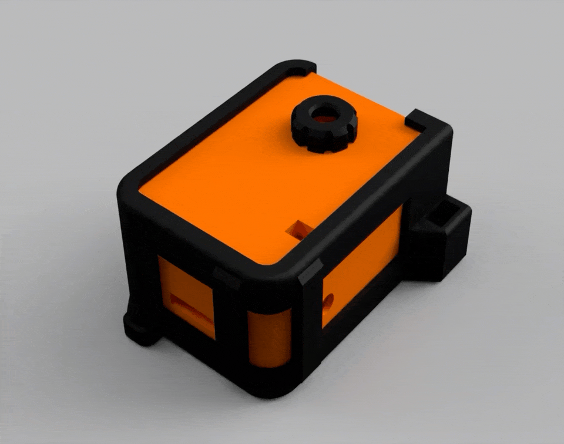

# Charm-Cam

  

> Built in collaboration with [Claude](https://claude.com), Anthropic's AI assistant — used throughout the project for code, design, and naming.

A Wi-Fi enabled point-and-shoot camera built for the AI-Thinker ESP32-CAM.

Charm-Cam turns the ESP32-CAM into a small standalone camera with a built-in web UI, SD card storage, analog film-roll simulation, digital mode, physical shutter support, and OTA firmware updates — designed to feel like a keychain charm you carry around and snap with.

## Features

- Access Point mode with configurable SSID and password
- Web UI for shooting, gallery viewing, archive browsing, and settings
- Two camera modes:
  - **Analog mode**: load a film, shoot up to 36 frames, then develop the roll
  - **Digital mode**: unlimited direct-to-gallery captures
- Physical shutter button support on GPIO13
- SD card image storage
- Developed roll archive storage by roll folder, with auto-incrementing roll numbers preserved across reboots
- Rename developed rolls from the web UI
- Delete individual saved photos and entire developed rolls from the web UI
- Toggleable flash for captures
- EXIF orientation tag injected at save time (zero-cost rotation, no re-encode)
- Persistent settings and roll state using ESP32 Preferences
- OTA firmware update page
- LED feedback for status, warnings, roll full, and new roll loaded

## Hardware

Designed for:

- AI-Thinker ESP32-CAM with OV2640 camera module — [buy on AliExpress](https://www.aliexpress.com/item/1005006299363624.html)  
  
- Battery
- USB C Charging board — [buy on AliExpress](https://www.aliexpress.com/item/1005009974716402.html)  
  
- Flat on/off switch
- Momentary shutter button connected between GPIO13 and GND
- microSD card

### 3D printable enclosure

STL/3MF files for the Charm-Cam case are in [3D Files/](3D%20Files/):

- `Charm-Cam-Front-v1.stl` / `Charm-Cam-Back-v1.stl` — main body halves
- `Charm-Cam-Cage-v1.stl` — internal frame holding the ESP32-CAM and battery
- `Charm-Cam-ESP-Cover-v1.stl` — module cover
- `Charm-Cam-Lens-v1.stl` — lens bezel
- `Charm-Cam-Parts-Holder-v1.stl` — print-bed jig for small parts
- `Charm-Cam-v1-PrintFILE.3mf` — pre-arranged print plate (PrusaSlicer / Bambu Studio)

### Pin usage

- **GPIO13**: shutter button
- **GPIO4**: flash LED
- **GPIO33**: red status LED (active LOW)

## How it works

### Analog mode

- Load a film roll from the web UI
- Capture up to 36 photos
- When the roll is full, the flash LED blinks quickly 3 times
- Develop the roll from the UI or by a long press of the shutter button
- Developed rolls are stored in archive folders on the SD card

### Digital mode

- No film loading required
- No 36-frame limit
- Captured images are saved directly to the gallery

### Physical shutter behavior

- **Short press**: capture immediately
- **Long press (2 seconds)** in analog mode: develop the current roll and automatically load a new roll of the same film
- If no film is loaded in analog mode, the status LED blinks 3 times as a warning

## Storage layout

Images are saved on the microSD card.

Typical folder structure:

- `/roll/` - current undeveloped analog roll
- `/photos/` - developed rolls and digital captures
- `/photos/rNN_filmname/` - one developed analog roll archive folder (NN is an auto-incrementing roll counter persisted in NVS)

## Web interface

After boot, the ESP32-CAM creates its own Wi-Fi hotspot.

Default settings:

- **SSID**: `Charm-Cam`
- **Password**: `camera123`

Connect to the hotspot and open the device IP shown in Serial Monitor, typically:

- `http://192.168.4.1`

From the web UI you can:

- capture photos
- load film
- develop rolls
- browse gallery and roll archive
- rename developed rolls
- delete saved photos or whole developed rolls
- switch between analog and digital mode
- toggle the flash on or off
- change hotspot name and password
- open the OTA firmware update page

## Build and upload

### Arduino IDE setup

Use Arduino IDE with ESP32 board support installed.

Recommended board settings for OTA:

- **Board**: AI Thinker ESP32-CAM
- **Partition Scheme**: Minimal SPIFFS (1.9MB APP with OTA / 128KB SPIFFS)

That partition scheme is important if you want OTA updates to work.

### First upload

1. Connect the ESP32-CAM over USB/serial programmer
2. Select the correct board and port
3. Upload the sketch normally from Arduino IDE
4. Open Serial Monitor at `115200` baud
5. Wait for the AP name and IP address to appear

## OTA updates

OTA is built into the firmware and available from the settings area.

Important notes:

- Use an OTA-capable partition scheme
- Upload only the main compiled firmware binary: the `.ino.bin` file
- Do **not** upload the bootloader, partition, or merged files through the OTA page

If OTA fails, the most common causes are:

- wrong partition scheme
- firmware binary too large for the OTA app slot
- uploading the wrong exported file

## Power notes

ESP32-CAM boards are sensitive to weak power supplies.

For stable behavior:

- use a good USB cable
- use a solid 5V power source
- avoid unstable or low-current adapters

Brownout or boot issues are often power related. The firmware also lowers Wi-Fi TX power to `8.5 dBm` to reduce brownout risk on marginal supplies.

## Project files

The current firmware lives in [esp32cam_camera-v1.2/](esp32cam_camera-v1.2/) and is split across:

- `esp32cam_camera-v1.2.ino` - main sketch (setup, loop, globals, shutter button handling)
- `config.h` - pin definitions, default credentials, roll size, button timing, capture rotation
- `html_main.h` - main web UI (PROGMEM)
- `html_ota.h` - OTA update page (PROGMEM)
- `camera.ino` - OV2640 camera init
- `storage.ino` - SD card, file ops, roll logic, capture, EXIF rotation
- `persistence.ino` - NVS load/save for settings and roll state
- `handlers.ino` - HTTP request handlers and route registration
- `led.ino` - status and flash LED helpers

A separate `diag_test/` sketch is included for hardware diagnostics.

## Notes

- Settings and roll state are saved in non-volatile storage and survive reboot
- The SD card is required for saving photos and roll archives
- The UI is designed around a film-camera workflow, even when digital mode is enabled

## Trademarks & brand assets

The film canister SVGs in [Filmrolls/](Filmrolls/) reproduce visual elements (logos, color palettes, typography) inspired by real film stocks (Kodak, Ilford, Velvia, etc.). These are included for aesthetic purposes only. All trademarks and brand identities belong to their respective owners. This project is not affiliated with, endorsed by, or sponsored by any film manufacturer.

## License

Released under the [MIT License](LICENSE) — free to use, modify, and distribute. This is a free hobby project; no warranty.
