# Charm-Cam

<p align="center">
  
</p>

[](https://claude.com)
[](LICENSE)

> Built in collaboration with [Claude](https://claude.com)

A Wi-Fi enabled point-and-shoot camera built for the AI-Thinker ESP32-CAM.

Charm-Cam turns the ESP32-CAM into a small standalone camera with a built-in web UI, SD card storage, analog film-roll simulation, digital mode, physical shutter support, and OTA firmware updates — designed to feel like a keychain charm you carry around and snap with.

## Features

- Access Point mode with configurable SSID and password
- Web UI for shooting, gallery viewing, archive browsing, and settings
- Two camera modes:
  - **Analog mode**: load a film, shoot up to 36 frames, then develop the roll
  - **Digital mode**: unlimited direct-to-gallery captures
- Physical shutter button support on GPIO13
- SD card image storage
- Developed roll archive storage by roll folder, with auto-incrementing roll numbers preserved across reboots
- Rename developed rolls from the web UI
- Delete individual saved photos and entire developed rolls from the web UI
- Toggleable flash for captures
- EXIF orientation tag injected at save time (zero-cost rotation, no re-encode)
- Persistent settings and roll state using ESP32 Preferences
- OTA firmware update page
- LED feedback for status, warnings, roll full, and new roll loaded

## Sample photos

Frames captured with Charm-Cam, straight from the SD card with no post-processing.

<table>
  <tr>
    <td>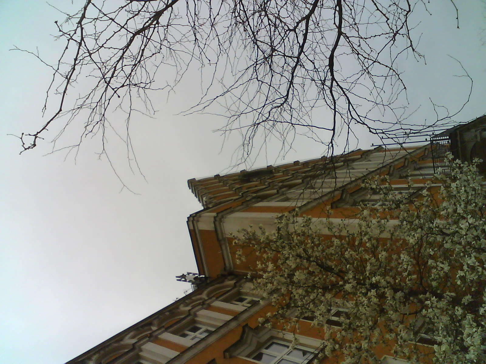</td>
    <td>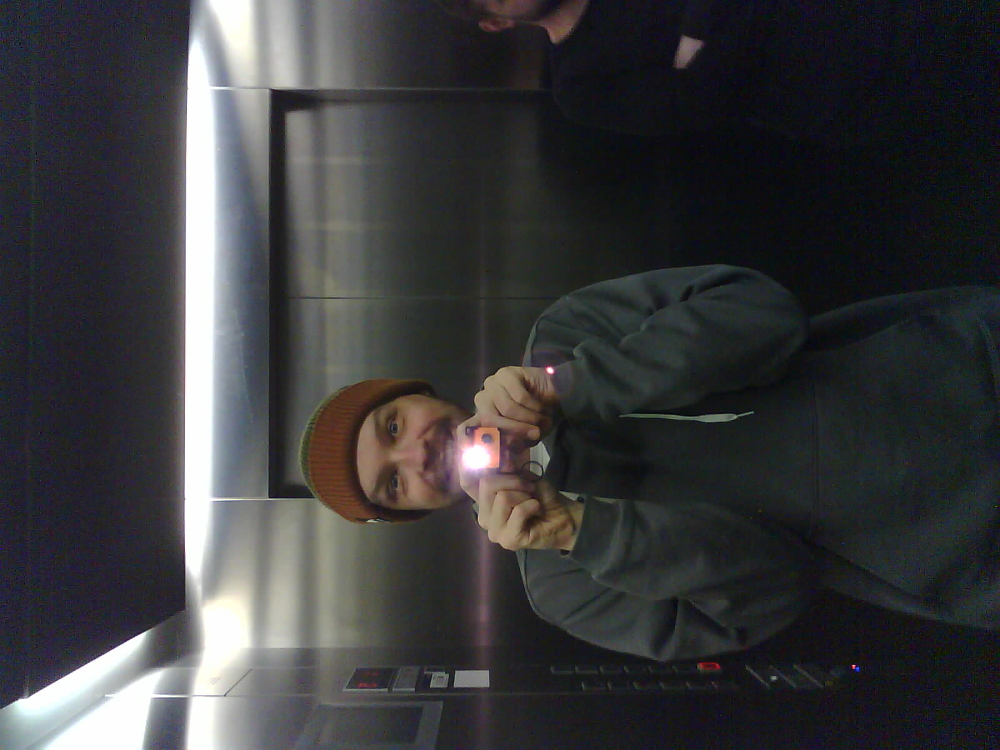</td>
    <td>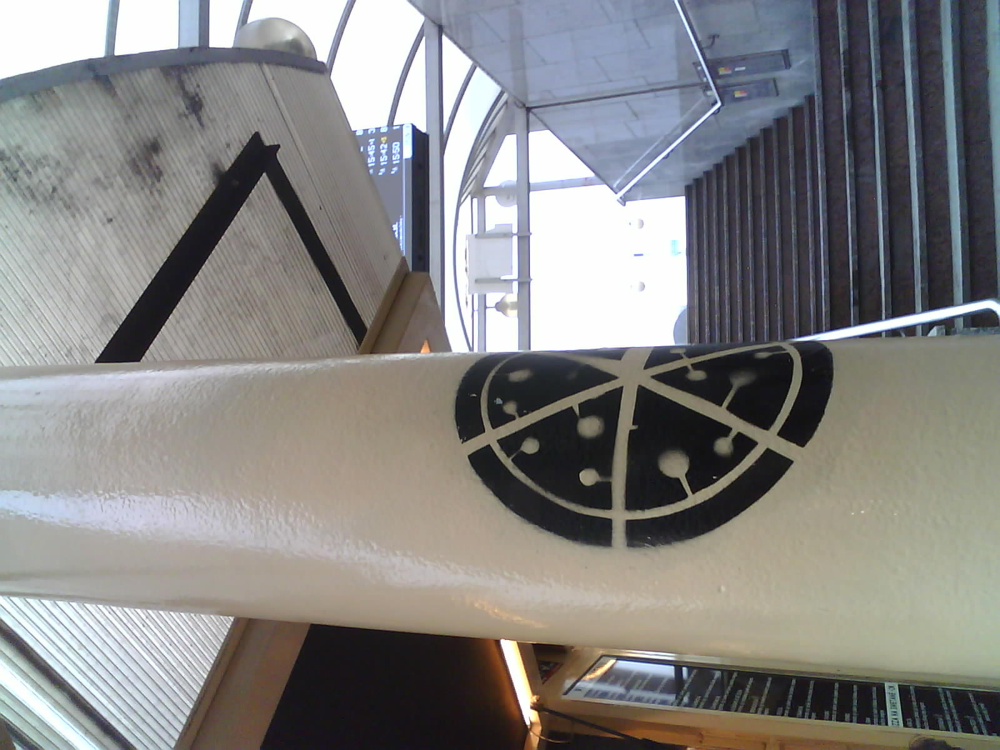</td>
    <td>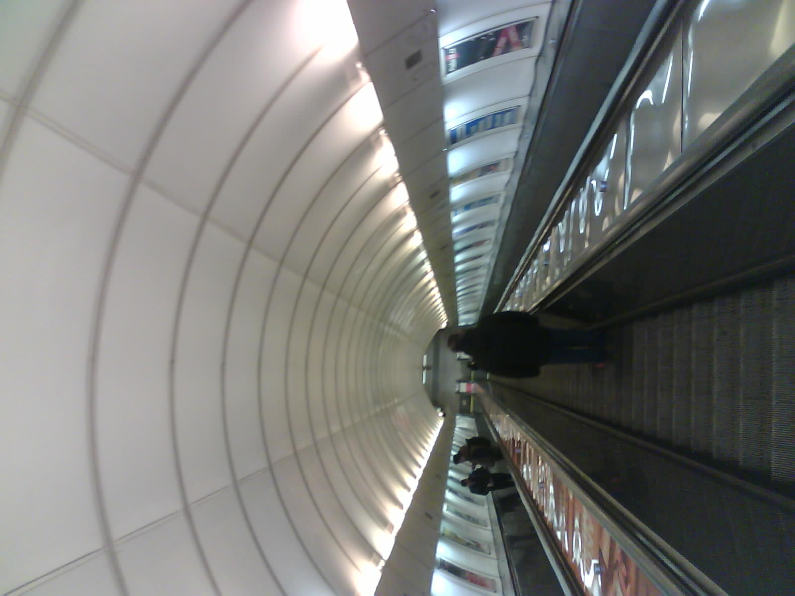</td>
  </tr>
  <tr>
    <td>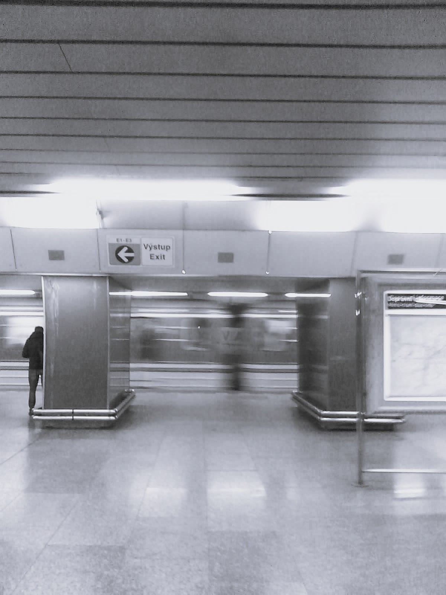</td>
    <td>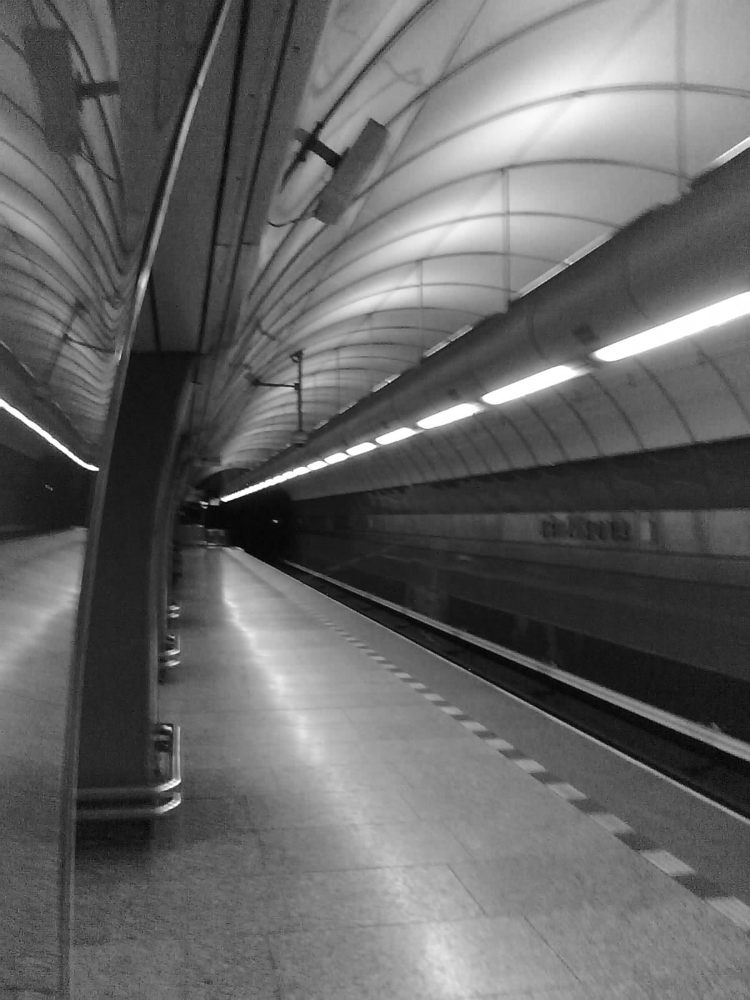</td>
    <td>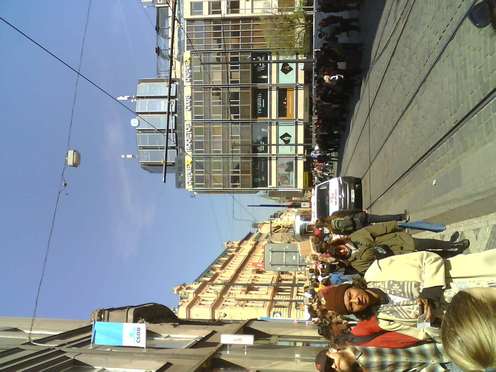</td>
    <td>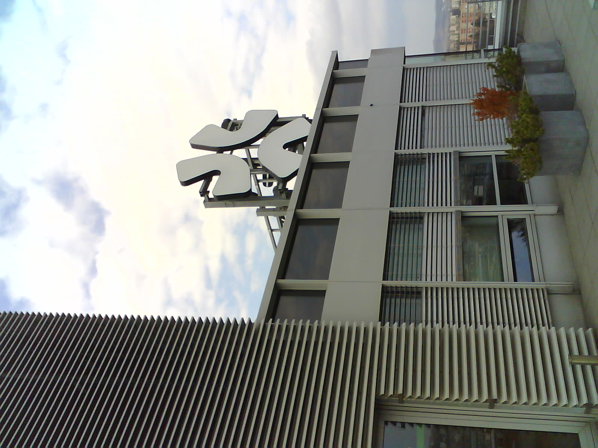</td>
  </tr>
</table>

## App

The whole interface runs on the ESP32-CAM itself — no cloud, no companion app, no internet required. Connect to the camera's Wi-Fi hotspot, open `http://192.168.4.1` in any browser (phone, tablet, laptop), and you get a self-contained film-camera UI styled in amber-on-black.

<table>
  <tr>
    <td width="280" valign="top">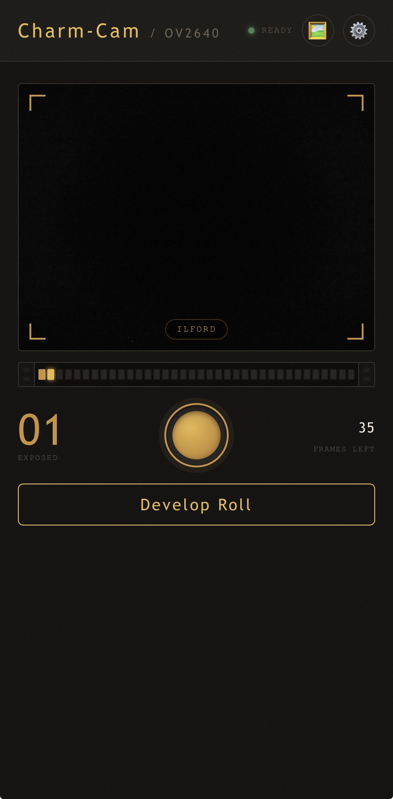</td>
    <td valign="top">
      <h3>Capture</h3>
      <p>The main shooting screen. Shows the live viewfinder, the loaded film stock (here: <em>Ilford</em>), the frame counter, frames remaining, and the big amber shutter button. The <strong>Develop Roll</strong> action below moves all exposures into the archive and resets the roll. Top bar carries the <em>Charm-Cam / OV2640</em> wordmark, a <em>READY</em> status pill, and quick access to gallery and settings.</p>
    </td>
  </tr>
  <tr>
    <td width="280" valign="top">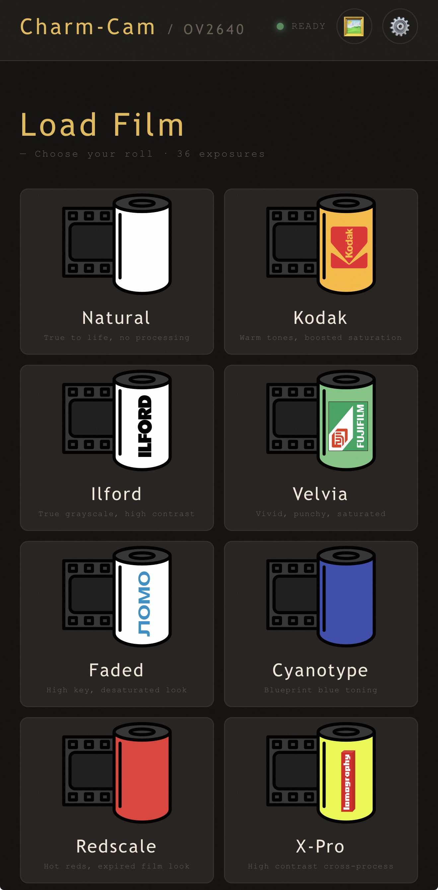</td>
    <td valign="top">
      <h3>Load Film</h3>
      <p>Pick the film stock for the next roll. Eight presets are included — <em>Natural, Kodak, Ilford, Velvia, Faded, Cyanotype, Redscale, X-Pro</em> — each shown as a film canister with a short personality description. Picking one starts a fresh 36-exposure roll.</p>
    </td>
  </tr>
  <tr>
    <td width="280" valign="top">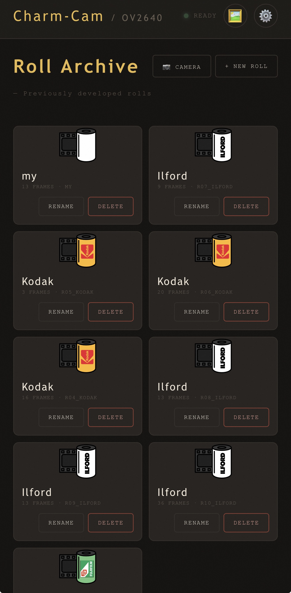</td>
    <td valign="top">
      <h3>Roll Archive</h3>
      <p>Every developed roll, with its frame count and folder name (<code>rNN_filmname</code>). Each row has <strong>Rename</strong> and <strong>Delete</strong> actions so you can curate the archive without touching the SD card. The top buttons jump back to the camera or load a new roll.</p>
    </td>
  </tr>
  <tr>
    <td width="280" valign="top">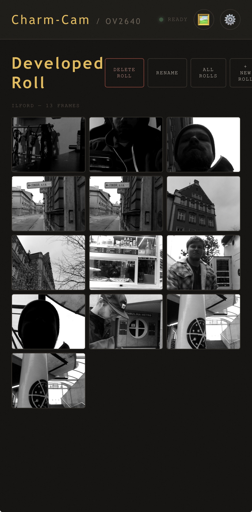</td>
    <td valign="top">
      <h3>Developed Roll</h3>
      <p>The contact-sheet view for a single developed roll. Browse all frames, tap any thumbnail to view full size, or remove the whole roll with <strong>Delete Roll</strong>. <strong>Rename</strong> lets you replace the auto-generated <code>rNN_filmname</code> name with something meaningful (e.g. <em>"Prague Saturday"</em>).</p>
    </td>
  </tr>
  <tr>
    <td width="280" valign="top">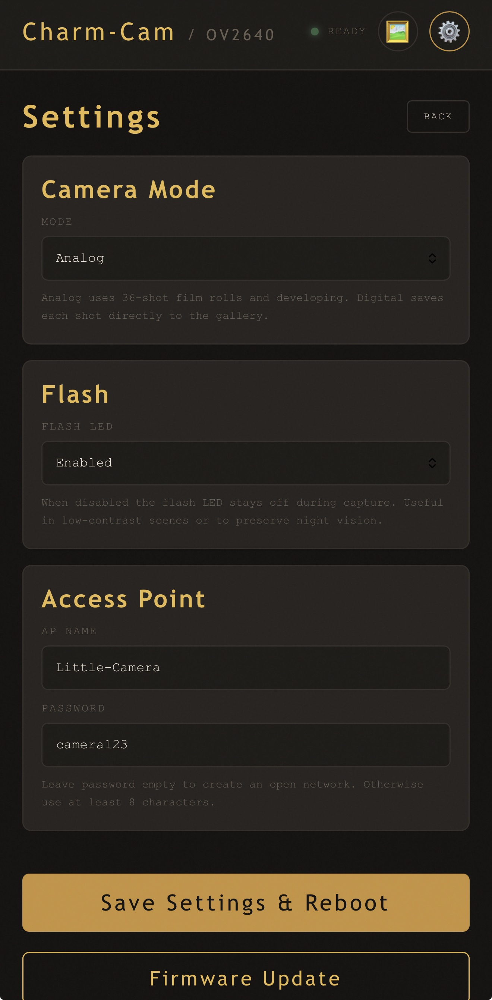</td>
    <td valign="top">
      <h3>Settings</h3>
      <p>Switch between <strong>Analog</strong> (36-shot rolls + developing) and <strong>Digital</strong> (direct-to-gallery) modes, toggle the flash LED, and change the AP name and password. Settings persist across reboots in NVS. <strong>Firmware Update</strong> opens the OTA upload page.</p>
    </td>
  </tr>
</table>

<p align="center">
  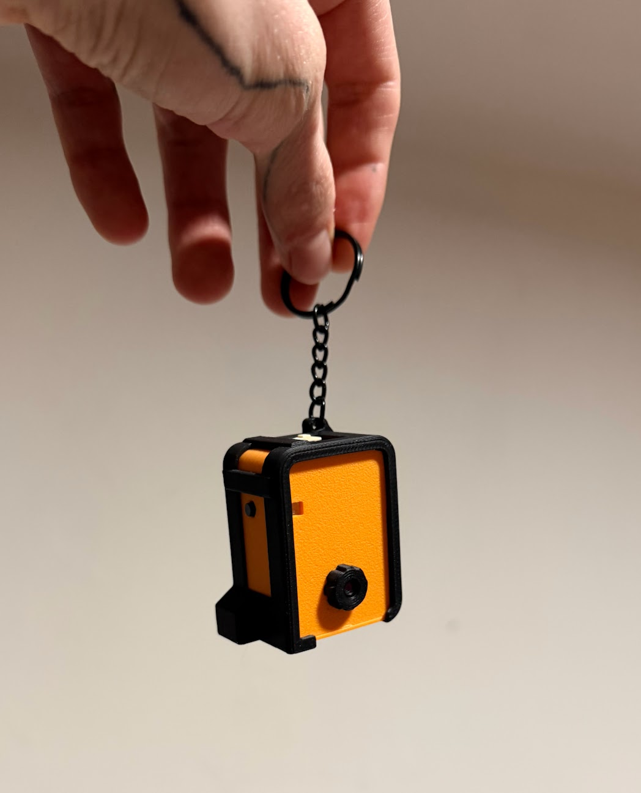
</p>

## Hardware

**Total cost: roughly $20 USD** for all electronic parts shipped from AliExpress (excluding the printed enclosure, which is a few grams of filament).

Designed for:

- AI-Thinker ESP32-CAM with OV2640 camera module — [buy on AliExpress](https://www.aliexpress.com/item/1005006385419669.html)  
  <a href="https://www.aliexpress.com/item/1005006385419669.html">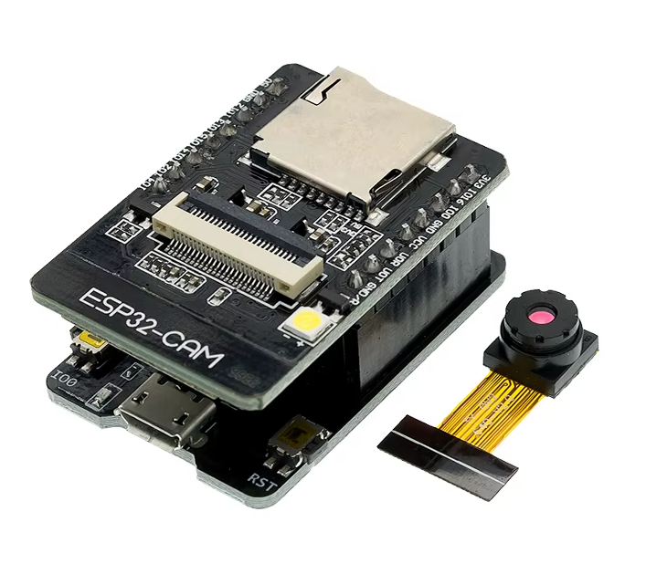</a>
- Battery — 3.7 V Li-Po cell, optimal dimensions **39 × 26 × 4.5 mm** to fit the enclosure. The prototype uses a **502040 350 mAh** cell (40 × 20 × 5 mm) — [buy on AliExpress](https://www.aliexpress.com/item/32986051711.html)  
  <a href="https://www.aliexpress.com/item/32986051711.html">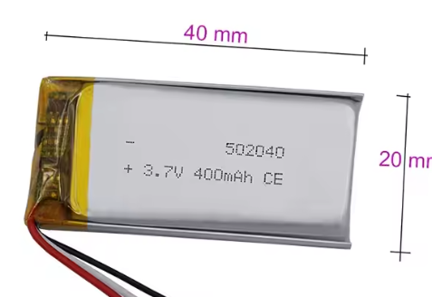</a>
- USB C Charging board — [buy on AliExpress](https://www.aliexpress.com/item/1005009974716402.html)  
  <a href="https://www.aliexpress.com/item/1005009974716402.html">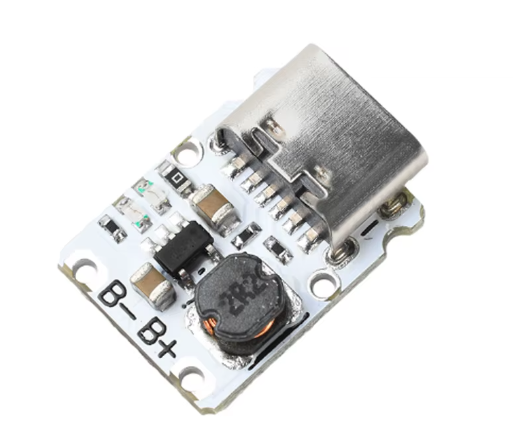</a>
- Flat on/off switch — **ESP1010 side-actuated slide switch** — [buy on AliExpress](https://www.aliexpress.com/item/1005007537444508.html)  
  <a href="https://www.aliexpress.com/item/1005007537444508.html">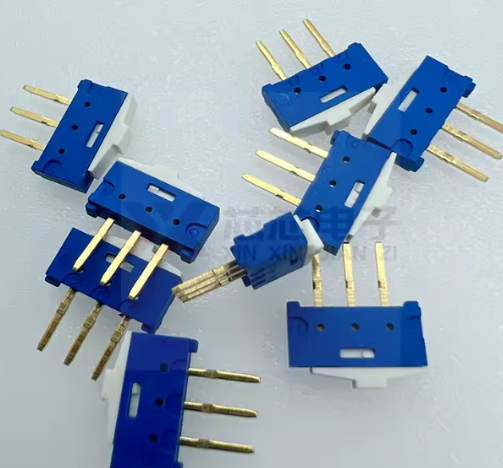</a>
- Momentary shutter button — **6 × 6 × 6 mm SMD tact switch**, connected between GPIO13 and GND — [buy on AliExpress](https://www.aliexpress.com/item/1005007046105681.html)  
  <a href="https://www.aliexpress.com/item/1005007046105681.html">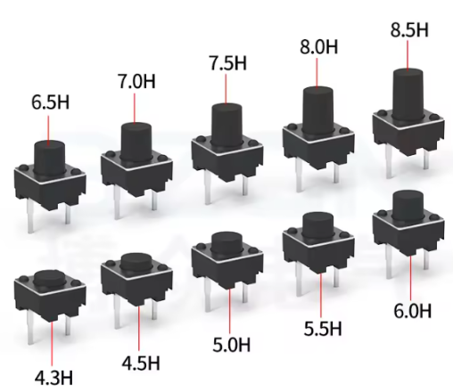</a>
- microSD card

### 3D printable enclosure

STL/3MF files for the Charm-Cam case are in [3D Files/](3D%20Files/):

- `Charm-Cam-Front-v1.stl` / `Charm-Cam-Back-v1.stl` — main body halves
- `Charm-Cam-Cage-v1.stl` — internal frame holding the ESP32-CAM and battery
- `Charm-Cam-ESP-Cover-v1.stl` — module cover
- `Charm-Cam-Lens-v1.stl` — lens bezel
- `Charm-Cam-Parts-Holder-v1.stl` — print-bed jig for small parts
- `Charm-Cam-v1-PrintFILE.3mf` — pre-arranged print plate (PrusaSlicer / Bambu Studio)

<table>
  <tr>
    <td>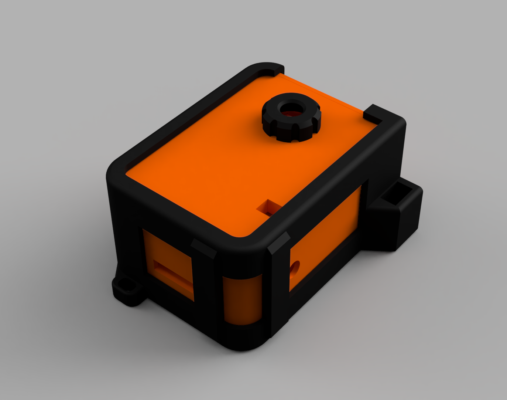</td>
    <td>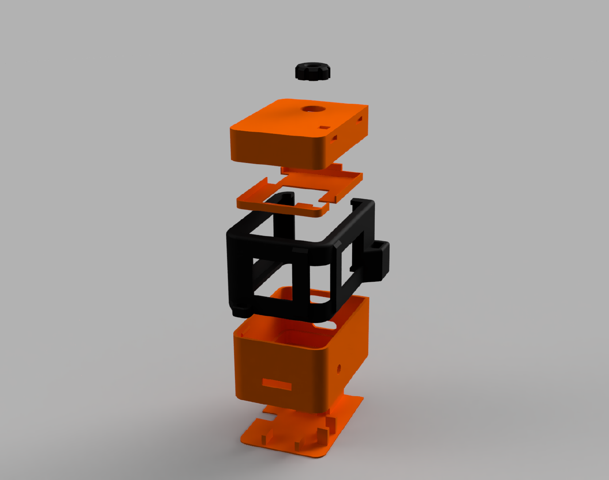</td>
  </tr>
</table>

### Wiring

<p align="center">
  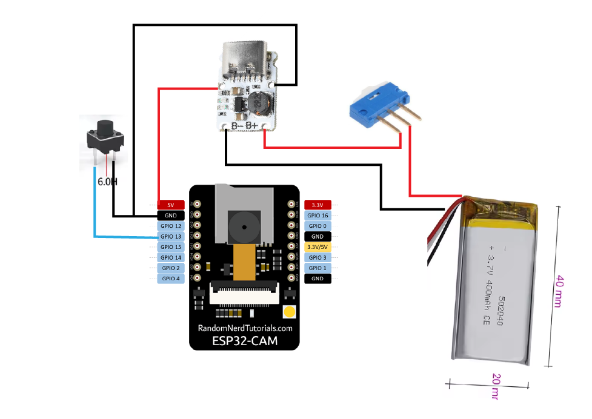
</p>

- **USB-C charging board** → ESP32-CAM `5V` / `GND` (power in, with the slide switch breaking the 5V line)
- **Li-Po battery** → charging board `B+` / `B-`
- **ESP1010 slide switch** → in-line on the 5V rail between charging board and ESP32-CAM (cuts power when off)
- **6×6×6 tact button** → ESP32-CAM `GPIO13` ↔ `GND` (the firmware uses `INPUT_PULLUP`, no external resistor needed)
- Onboard **flash LED** (GPIO4) and **status LED** (GPIO33) are already on the ESP32-CAM board

### Pin usage

- **GPIO13**: shutter button
- **GPIO4**: flash LED
- **GPIO33**: red status LED (active LOW)

## How it works

### Analog mode

- Load a film roll from the web UI
- Capture up to 36 photos
- When the roll is full, the flash LED blinks quickly 3 times
- Develop the roll from the UI or by a long press of the shutter button
- Developed rolls are stored in archive folders on the SD card

### Digital mode

- No film loading required
- No 36-frame limit
- Captured images are saved directly to the gallery

### Physical shutter behavior

- **Short press**: capture immediately
- **Long press (2 seconds)** in analog mode: develop the current roll and automatically load a new roll of the same film
- If no film is loaded in analog mode, the status LED blinks 3 times as a warning

## Storage layout

Images are saved on the microSD card.

Typical folder structure:

- `/roll/` - current undeveloped analog roll
- `/photos/` - developed rolls and digital captures
- `/photos/rNN_filmname/` - one developed analog roll archive folder (NN is an auto-incrementing roll counter persisted in NVS)

## Web interface

After boot, the ESP32-CAM creates its own Wi-Fi hotspot.

Default settings:

- **SSID**: `Charm-Cam`
- **Password**: `camera123`

Connect to the hotspot and open the device IP shown in Serial Monitor, typically:

- `http://192.168.4.1`

From the web UI you can:

- capture photos
- load film
- develop rolls
- browse gallery and roll archive
- rename developed rolls
- delete saved photos or whole developed rolls
- switch between analog and digital mode
- toggle the flash on or off
- change hotspot name and password
- open the OTA firmware update page

## Build guide

End-to-end instructions to go from zero to a working Charm-Cam.

### What you need before starting

- All parts from the [Hardware](#hardware) list — **~$20 USD total** from AliExpress
- A 3D printer (or a print service) for the enclosure
- A computer with a USB port
- A USB cable suitable for your flashing setup (see step 5)
- Basic soldering iron + thin wire (28–30 AWG works well)
- Roughly **2–3 hours** of build time (excluding the print)

### 1. Print the enclosure

Open [`3D Files/Charm-Cam-v1-PrintFILE.3mf`](3D%20Files/Charm-Cam-v1-PrintFILE.3mf) in PrusaSlicer or Bambu Studio — the plate is already arranged. If you prefer to arrange manually, use the individual `.stl` files in [3D Files/](3D%20Files/).

Recommended print settings:

- **Material**: PLA or PETG
- **Layer height**: 0.16 mm (or 0.2 mm if you're in a hurry)
- **Walls**: 3 perimeters
- **Infill**: 20 % grid or gyroid
- **Supports**: only where the slicer suggests them — the parts are designed to print mostly support-free
- **Print time**: ~3–5 hours depending on slicer/printer

Once printed, dry-fit the ESP32-CAM into the cage and check the lens bezel slides onto the camera module before soldering anything.

### 2. Install the Arduino IDE

Download Arduino IDE 2.x from [arduino.cc/en/software](https://www.arduino.cc/en/software) and install it. Launch it once to let it create its `Arduino` folder in your Documents.

### 3. Install ESP32 board support

1. Open **File → Preferences**.
2. In **Additional boards manager URLs**, paste:
   ```
   https://raw.githubusercontent.com/espressif/arduino-esp32/gh-pages/package_esp32_index.json
   ```
   (Multiple URLs go on separate lines.)
3. **Tools → Board → Boards Manager…** → search **`esp32`** → install **"esp32" by Espressif Systems** (latest stable, 2.x or newer).

### 4. Download the project

Either:

- Click **Code → Download ZIP** on this GitHub page and unzip it, or
- Clone with git:
  ```
  git clone https://github.com/FRSname/charm-cam.git
  ```

### 5. Open the project

In Arduino IDE: **File → Open…** and pick [`esp32cam_camera-v1.2/esp32cam_camera-v1.2.ino`](esp32cam_camera-v1.2/esp32cam_camera-v1.2.ino). The other `.ino`, `.h`, and `config.h` files in the same folder will open as tabs alongside it.

### 6. Configure the board

In the **Tools** menu, set:

- **Board** → *ESP32 Arduino → AI Thinker ESP32-CAM*
- **Partition Scheme** → *Minimal SPIFFS (1.9MB APP with OTA / 190KB SPIFFS)*  
  *(Required for OTA — the default partition has no OTA slot.)*
- **CPU Frequency** → *240MHz*
- **Flash Mode** → *QIO*
- **Flash Frequency** → *80MHz*
- **Upload Speed** → *115200* (raise later if reliable)

### 7. Connect the ESP32-CAM for flashing

The bare AI-Thinker ESP32-CAM has **no USB** — you need one of:

- **ESP32-CAM-MB baseboard** (recommended) — plugs onto the ESP32-CAM pins, exposes a USB-C/micro-USB port, and handles the auto-reset-into-flashing-mode dance for you. No jumpers needed.
- **USB-to-TTL adapter** (CP2102, CH340, FT232) — wire it manually:
  - Adapter `5V` → ESP32-CAM `5V`
  - Adapter `GND` → ESP32-CAM `GND` *and* ESP32-CAM `GPIO0` (jumper GPIO0 to GND to enter flash mode)
  - Adapter `TX` → ESP32-CAM `U0R`
  - Adapter `RX` → ESP32-CAM `U0T`
  - Press the on-board **RST** button just before upload starts. Remove the GPIO0 jumper after flashing.

Plug it into your computer and confirm the COM port appears in **Tools → Port**.

### 8. Flash the firmware

1. Select the COM port assigned to your adapter / baseboard.
2. Click **Upload** (the right arrow icon).
3. Wait through compile + upload. The first build takes a couple of minutes; subsequent ones are faster.
4. Open **Tools → Serial Monitor** at **115200 baud**. You should see:
   ```
   Charm-Cam starting...
   >> STEP 1: WiFi AP...
   Hotspot: Charm-Cam — connect and go to http://192.168.4.1
   ```

Test the firmware *before* you solder anything into the case — easier to fix issues now.

### 9. Test the web UI

1. On your phone or laptop, connect to the Wi-Fi network **`Charm-Cam`** (password `camera123`).
2. Open **http://192.168.4.1** in a browser.
3. Load a film, take a shot. Confirm it appears in the gallery.
4. If anything is broken, fix it before assembly. Re-flash as needed.

### 10. Wire the components

With the ESP32-CAM out of the baseboard, follow the diagram in [Wiring](#wiring). In order:

1. Solder the **6×6×6 tact button** between ESP32-CAM `GPIO13` and `GND`. Keep wires short and route them along the cage.
2. Solder a wire from the USB-C charging board **OUT+** to one terminal of the **ESP1010 slide switch**, then from the other switch terminal to ESP32-CAM **5V**. The switch breaks the 5V rail.
3. Solder USB-C charging board **OUT−** to ESP32-CAM **GND**.
4. Solder the **Li-Po battery** wires to the charging board **B+** (red) and **B−** (black). Double-check polarity — reversed Li-Po can vent or catch fire.
5. Insert a **microSD card** into the ESP32-CAM slot.

### 11. Assemble

1. Seat the ESP32-CAM into the printed **Cage** part. The lens points through the front opening.
2. Place the **Lens bezel** over the OV2640 module.
3. Tuck the battery into its slot in the Cage.
4. Position the USB-C charging board, switch, and shutter button so they line up with their cutouts in the **Front/Back** halves.
5. Sandwich the front and back together. The press-fit should hold them; add a dab of glue at the seam if needed.

### 12. First power-on

1. Charge the battery via the USB-C port until the charging LED indicates full.
2. Flip the slide switch to **ON**.
3. Watch for the flash LED to blink the boot sequence (1× → 2× → 3× → 4× → 5× → 6×, then 3 fast blinks = ready).
4. Connect to the `Charm-Cam` Wi-Fi, open the UI, take your first shot.

Congratulations — you've built a Charm-Cam.

## OTA updates

After the first wired flash, you can update the firmware wirelessly via the **Firmware Update** page in Settings (the OTA path).

### Producing the OTA binary

1. In Arduino IDE: **Sketch → Export Compiled Binary**.
2. Find the binary in the sketch folder — use the file named `esp32cam_camera-v1.2.ino.bin` (the **plain** one, not `merged`, `bootloader`, or `partitions`).

### Uploading via OTA

1. Connect to the `Charm-Cam` Wi-Fi.
2. Open Settings → **Firmware Update**.
3. Choose the `.ino.bin` file and upload.
4. The device reboots into the new firmware automatically.

### If OTA fails

- Wrong partition scheme — re-flash via USB with **Minimal SPIFFS** selected.
- Binary too large for the OTA app slot — strip unused features or use a larger-app partition.
- You uploaded the wrong file — use `*.ino.bin`, not `*.merged.bin` / `*.bootloader.bin` / `*.partitions.bin`.

## Power notes

ESP32-CAM boards are sensitive to weak power supplies.

For stable behavior:

- use a good USB cable
- use a solid 5V power source
- avoid unstable or low-current adapters

Brownout or boot issues are often power related. The firmware also lowers Wi-Fi TX power to `8.5 dBm` to reduce brownout risk on marginal supplies.

## Project files

The current firmware lives in [esp32cam_camera-v1.2/](esp32cam_camera-v1.2/) and is split across:

- `esp32cam_camera-v1.2.ino` - main sketch (setup, loop, globals, shutter button handling)
- `config.h` - pin definitions, default credentials, roll size, button timing, capture rotation
- `html_main.h` - main web UI (PROGMEM)
- `html_ota.h` - OTA update page (PROGMEM)
- `camera.ino` - OV2640 camera init
- `storage.ino` - SD card, file ops, roll logic, capture, EXIF rotation
- `persistence.ino` - NVS load/save for settings and roll state
- `handlers.ino` - HTTP request handlers and route registration
- `led.ino` - status and flash LED helpers

A separate `diag_test/` sketch is included for hardware diagnostics.

## Notes

- Settings and roll state are saved in non-volatile storage and survive reboot
- The SD card is required for saving photos and roll archives
- The UI is designed around a film-camera workflow, even when digital mode is enabled

## Trademarks & brand assets

The film canister SVGs in [Filmrolls/](Filmrolls/) reproduce visual elements (logos, color palettes, typography) inspired by real film stocks (Kodak, Ilford, Velvia, etc.). These are included for aesthetic purposes only. All trademarks and brand identities belong to their respective owners. This project is not affiliated with, endorsed by, or sponsored by any film manufacturer.

## License

Released under the [MIT License](LICENSE) — free to use, modify, and distribute. This is a free hobby project; no warranty.
